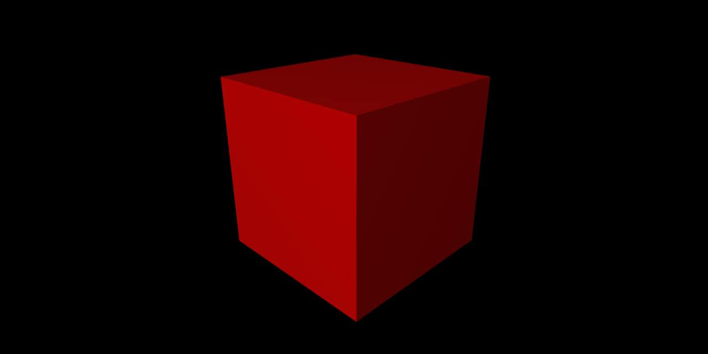

# Three.js - Template - Simple
### Based on the ThreeJS Journey Template by Bruno Simon
[https://github.com/brunosimon/webpack-three-js-template](https://github.com/brunosimon/webpack-three-js-template)



## Setup
- Download [Node.js](https://nodejs.org/en/download/) and run the following commands:

- Install dependencies (only the first time)
``` bash
npm install
```
- Run the local server at localhost:8080
``` bash
npm run dev
```
- Build for production in the ./dist folder
``` bash
npm run build
```
